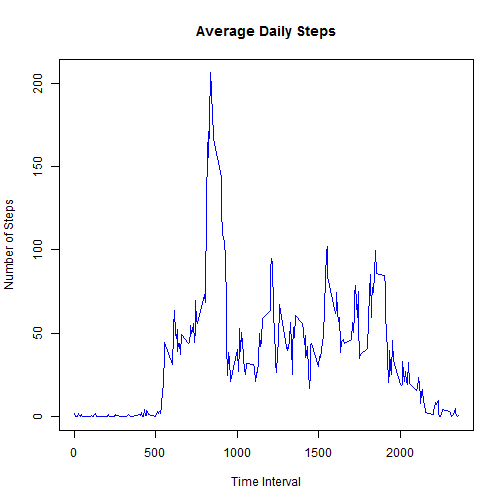
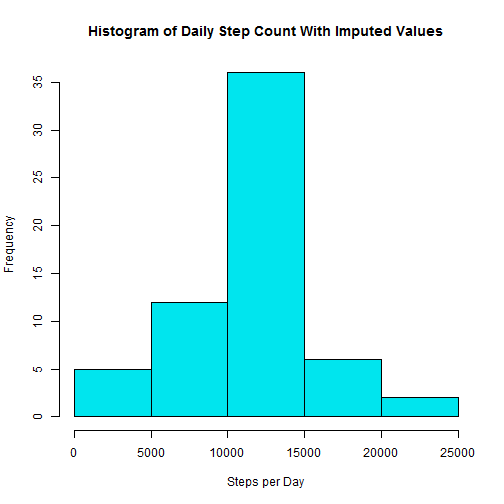
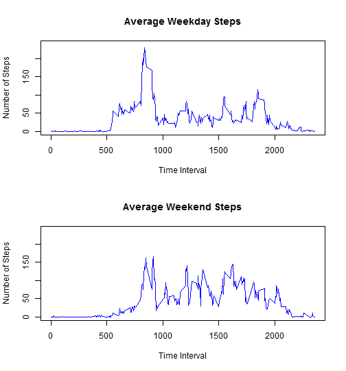

## Introduction
This report uses data from a personal activity monitoring device. This device collects data at 5 minute intervals through out the day. The data consists of two months of data from an anonymous individual collected during the months of October and November, 2012 and includes the number of steps taken in 5 minute intervals each day. There are 8 days that do not have any recorded measurements.


## Loading and preprocessing the data


```r
# Set working directory
setwd("~/Coursera/Reproducible Research/Peer Assessment 1")

# Unzip data
unzip("repdata_data_activity.zip")

# Read in data
activity <- read.csv("activity.csv")

# Recode dates to R formatting
activity$date <- as.Date(activity$date)
```


## What is mean total number of steps taken per day?


```r
# Create new data frame with daily totals
activity_day <- aggregate(steps ~ date, data = activity, FUN = sum)

# Plot historgram of daily step totals
hist(activity_day$steps, main = "Histogram of Daily Step Count", 
     xlab = "Steps per Day", col = "turquoise2")
```

 

```r
# Find mean and median steps, create variables to report in text
meanSteps <- round(mean(activity_day$steps), digits = 1)
medianSteps <- median(activity_day$steps)
```

The mean number of steps per day is 10766.2, and the median number of steps per day is 10765.

## What is the average daily activity pattern?


```r
# Create data frame 
activity_int <- aggregate(steps ~ interval, data = activity, FUN = mean)

# Plot time series
plot(activity_int$interval, activity_int$steps, type = "l", lwd = 1.75,
     main = "Average Daily Steps", xlab = "Time Interval", 
     ylab ="Number of Steps", col = "blue")
```

 

```r
# Create variables for interval with max steps and number of max steps
maxStepInterval <- activity_int[activity_int$steps == max(activity_int$steps), 1]
maxAvgSteps <- round(activity_int[activity_int$steps == max(activity_int$steps), 2], digits = 1)

# Create character string for time        
intTime <- paste(floor(maxStepInterval / 100), ":", 
      maxStepInterval - floor(maxStepInterval/100) * 100, sep = "")
```

On average across all the days in the dataset, the 5-minute interval starting at 8:35 contains the maximum number of steps with 206.2 steps.

## Imputing missing values


```r
# Find total number of missing values
totMiss <- sum(is.na(activity$steps))

# Create new single imputation data set
activity_imputed <- activity

# Run through newly created data set and replace missing with mean for time interval
for (i in 1:length(activity_imputed$steps))
        if (is.na(activity_imputed$steps[i])){
                tempInt <- activity_imputed$interval[i]
                activity_imputed$steps[i] <- activity_int$steps[
                        activity_int$interval == tempInt]
        }

# Create new data frame with daily totals
activity_imputed_day <- aggregate(steps ~ date, data = activity_imputed, FUN = sum)

# Plot historgram of daily step totals
hist(activity_imputed_day$steps, 
     main = "Histogram of Daily Step Count With Imputed Values", 
     xlab = "Steps per Day", col = "turquoise2")
```

 

```r
# Find mean and median steps, create variables to report in text
meanStepsImp <- round(mean(activity_imputed_day$steps), digits = 1)
medianStepsImp <- round(median(activity_imputed_day$steps), digits = 1)
```

There are a total of 2304 intervals with missing step values. I choose to do a single imputation by replacing the missing steps values with the mean of the values from the same time interval. Looking at the histogram with the imputed values, the shape of the distribution looks consistent. This is probably because the missing values can from the 8 days and were not scattered over all of the days steps were tracked. However, the downside to using single imputation is that it decreases the standard deviation, and this is something to be aware of whenever using single imputation. The increased frequency of the tallest bar (10,000-15,000 steps per day) suggests this likely has happened here, as the 8 missing days now have an average total steps the same as the daily average. With the imputed values, the mean is now 10766.2 and the median is 10766.2. By using a this method of single imputation the mean does not change. The median increases by 1.2 steps.


## Are there differences in activity patterns between weekdays and weekends?


```r
# Create character variable with name of day and logical weekend variable 
activity_imputed$day <- weekdays(activity_imputed$date)
activity_imputed$weekend <- activity_imputed$day == "Saturday" |
        activity_imputed$day == "Sunday"

# Create data frame with weekday only and then data frame with interval step means
activity_weekday <- activity_imputed[!activity_imputed$weekend, ]
activity_weekday_int <- aggregate(steps ~ interval, data = activity_weekday, FUN = mean)

# Create data frame with weekend only and then data frame with interval step means
activity_weekend <- activity_imputed[activity_imputed$weekend, ]
activity_weekend_int <- aggregate(steps ~ interval, data = activity_weekend, FUN = mean)

# Adjust parameters to create panel plot
par(mfrow = c(2, 1))

# Plot time series for weekdays and weekends by time interval
plot(activity_weekday_int$interval, activity_weekday_int$steps, 
     type = "l", lwd = 1.75, main = "Average Weekday Steps", 
     xlab = "Time Interval", ylab ="Number of Steps", col = "blue",
     ylim = c(0, 240))
plot(activity_weekend_int$interval, activity_weekend_int$steps, 
     type = "l", lwd = 1.75, main = "Average Weekend Steps", 
     xlab = "Time Interval", ylab ="Number of Steps", col = "blue",
     ylim = c(0, 240))
```

 

```r
# Find mean number of steps for weekend and weeday
meanWeekdaySteps <- round(sum(activity_weekday_int$steps), digits = 1)
meanWeekendSteps <- round(sum(activity_weekend_int$steps), digits = 1)
```

Examining the plots comparing the average weekday and weekend by time interval, it would appear that there are some difference in the patterns of when steps are taken. This person appear to be active between 8:00-9:30 or so daily, regardless of whether it is a weekday or weekend. They do not get as many steps during this time on the weekends compared to weekdays, however, they are much more active overall throughout the rest of the day on the weekends. This higher activity level results in a higher average number of steps on the weekend, 12201.5 steps, than on the weekdays, 10255.8 steps. 
